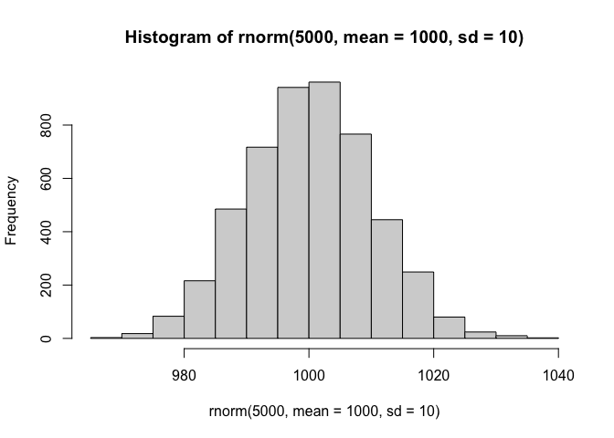
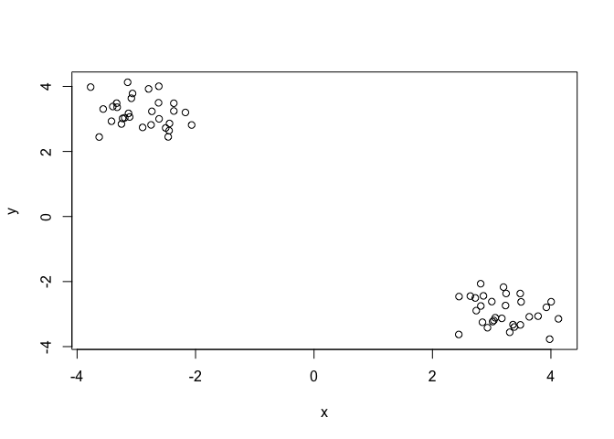
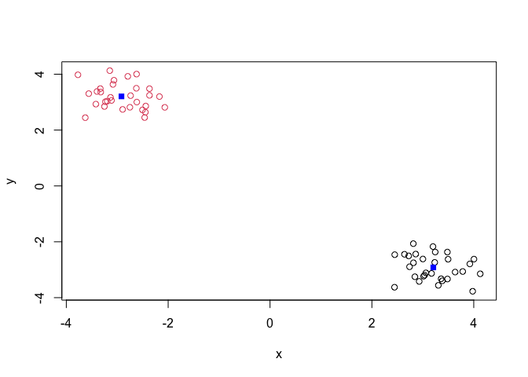
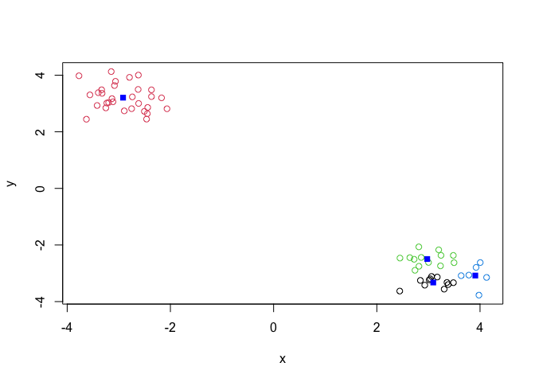
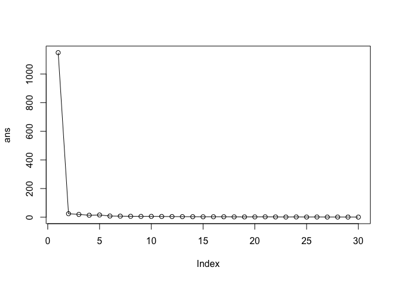
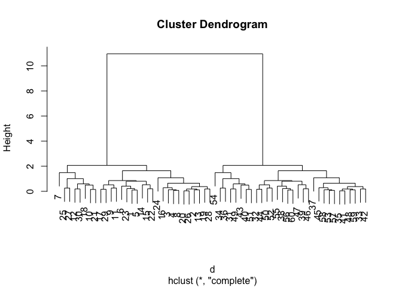
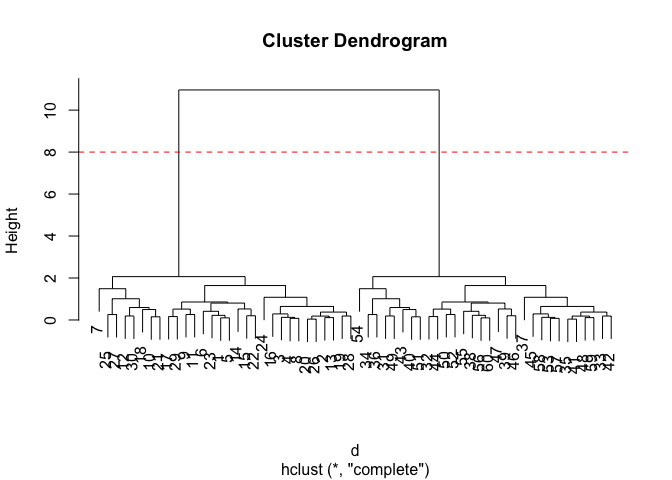

# Class 7: Machine Learning 1
Ivan Henry Kish (PID:A17262923)

## Background

Today we will begin our exploration of some important machine learning
methods, namely **clustering** and **dimensionality reduction**

Let’s make up some input data where we know what the natural “clusters”
are.

The function `rnorm()` can be useful here. \## K-means clustering

``` r
hist(rnorm(5000, mean=1000, sd= 10))
```



> Q.Generate 30 random numbers centered at +3 and another 30 at -3.

``` r
rnorm(30, mean=3,sd=0.5)
```

     [1] 1.629182 2.608589 3.399355 3.596355 2.605120 3.149401 4.038504 3.188546
     [9] 2.725897 3.977179 3.171945 3.491244 4.133453 3.005305 2.544287 3.496850
    [17] 3.071014 3.175214 3.531985 2.268396 3.517722 3.454669 3.573731 3.448549
    [25] 2.565921 3.441042 3.300339 2.753796 2.512567 2.362227

``` r
rnorm(30, mean=-3,sd=0.5)
```

     [1] -3.062350 -3.208995 -2.950055 -3.316437 -3.397926 -3.574935 -3.756823
     [8] -3.145476 -2.769586 -2.783789 -3.038067 -2.867491 -2.124882 -3.309573
    [15] -2.708395 -2.542355 -3.039655 -2.809919 -2.933353 -2.818674 -2.725357
    [22] -2.856599 -3.622845 -2.469724 -2.939297 -3.745873 -3.061226 -3.086481
    [29] -3.206050 -3.758356

``` r
tmp<- c(rnorm(30, mean=3,sd=0.5),rnorm(30, mean=-3,sd=0.5))

x <- cbind(x=tmp, y=rev(tmp))
plot(x)
```



## K-means clustering

The main function in “base R” for k-means clustering is called
surprisingly `kmeans()`:

``` r
km <- kmeans(x,2)
km
```

    K-means clustering with 2 clusters of sizes 30, 30

    Cluster means:
              x         y
    1  3.206028 -2.917095
    2 -2.917095  3.206028

    Clustering vector:
     [1] 1 1 1 1 1 1 1 1 1 1 1 1 1 1 1 1 1 1 1 1 1 1 1 1 1 1 1 1 1 1 2 2 2 2 2 2 2 2
    [39] 2 2 2 2 2 2 2 2 2 2 2 2 2 2 2 2 2 2 2 2 2 2

    Within cluster sum of squares by cluster:
    [1] 12.10033 12.10033
     (between_SS / total_SS =  97.9 %)

    Available components:

    [1] "cluster"      "centers"      "totss"        "withinss"     "tot.withinss"
    [6] "betweenss"    "size"         "iter"         "ifault"      

> Q. What component of the results object details the cluster sizes?

``` r
km$size
```

    [1] 30 30

> Q. What component of the results object details the cluster centers?

``` r
km$centers
```

              x         y
    1  3.206028 -2.917095
    2 -2.917095  3.206028

> Q. What component of the results object details the cluster membership
> vector(i.e our main result of which points lie in which cluster)?

``` r
km$cluster
```

     [1] 1 1 1 1 1 1 1 1 1 1 1 1 1 1 1 1 1 1 1 1 1 1 1 1 1 1 1 1 1 1 2 2 2 2 2 2 2 2
    [39] 2 2 2 2 2 2 2 2 2 2 2 2 2 2 2 2 2 2 2 2 2 2

> Q. Plot our clustering results with points colored by cluster and also
> add the cluster centers as new points colored blue.

``` r
plot(x, col=km$cluster)
points(km$centers, col="blue",pch=15)
```



> Q. Run`kmeans()` agains but this time produce 4 clusters and call your
> resulting object `k4` and make a reulsts figure like the one we made
> above.

``` r
k4 <- kmeans(x,4)
k4
```

    K-means clustering with 4 clusters of sizes 11, 30, 13, 6

    Cluster means:
              x         y
    1  3.093701 -3.325838
    2 -2.917095  3.206028
    3  2.976849 -2.496092
    4  3.908519 -3.079909

    Clustering vector:
     [1] 3 1 1 1 3 3 4 1 3 4 3 4 1 3 3 1 3 4 1 1 4 3 3 1 3 1 3 1 3 4 2 2 2 2 2 2 2 2
    [39] 2 2 2 2 2 2 2 2 2 2 2 2 2 2 2 2 2 2 2 2 2 2

    Within cluster sum of squares by cluster:
    [1]  1.1523163 12.1003281  1.9351309  0.9293242
     (between_SS / total_SS =  98.6 %)

    Available components:

    [1] "cluster"      "centers"      "totss"        "withinss"     "tot.withinss"
    [6] "betweenss"    "size"         "iter"         "ifault"      

``` r
plot(x, col=k4$cluster)
points(k4$centers, col="blue",pch=15)
```



The Metric

``` r
km$tot.withinss
```

    [1] 24.20066

``` r
k4$tot.withinss
```

    [1] 16.1171

> Q. Let’s ty different number of K (centers) from 1-30 and see what the
> best result is.

``` r
ans <- NULL
for(i in 1:30){
ans <- c(ans, kmeans(x,centers=i)$tot.withinss)
}
ans
```

     [1] 1148.9800635   24.2006562   19.2869874   13.6583780   15.3701374
     [6]    8.0335430    7.1882639    6.0943019    5.3853411    5.6569861
    [11]    4.9213020    4.2145654    3.7872290    3.3502614    2.7388501
    [16]    3.0040088    2.8750775    2.1221899    1.9324019    1.9329807
    [21]    2.4621301    1.6929391    1.1283280    1.7171698    1.0429413
    [26]    1.3902334    0.9477159    0.9723040    0.7941422    0.5879493

``` r
plot(ans, typ="o")
```



`tot.withinss` shows how tight the clusters are. The lower the value the
tighter the clusters.

**Key-point**: \*\* K-means will impose a clustering structure on your
data even if it is not there- it will always give the answer you asked
for

## Hierarchical CLustering

The main function for Hierarchical Clustering is called `hclust()`.
Unlike `kmeans()` (which does all the work for us) you can’t just pass
`hclust()` our raw input data. It needs a “distance matrix” like the one
returned frm the `dist()` function.

``` r
d <- dist(x)
hc <- hclust(d)
plot(hc)
```



To extract our cluster membership vector from a `hclus` result object we
have to “cut” our tree at a given height to yield seperate
“groups”/“branches”.

``` r
plot(hc)
abline(h=8, col="red",lty=2)
```



To do this we use the `cutree()` function o our `hclust()` object:

``` r
grps <- cutree(hc, h=8)
grps
```

     [1] 1 1 1 1 1 1 1 1 1 1 1 1 1 1 1 1 1 1 1 1 1 1 1 1 1 1 1 1 1 1 2 2 2 2 2 2 2 2
    [39] 2 2 2 2 2 2 2 2 2 2 2 2 2 2 2 2 2 2 2 2 2 2

``` r
table(grps, km$cluster)
```

        
    grps  1  2
       1 30  0
       2  0 30

## PCA of UK food data

Import the data set of food consumption in the UK:

``` r
url <- "https://tinyurl.com/UK-foods"
x <- read.csv(url)
x
```

                         X England Wales Scotland N.Ireland
    1               Cheese     105   103      103        66
    2        Carcass_meat      245   227      242       267
    3          Other_meat      685   803      750       586
    4                 Fish     147   160      122        93
    5       Fats_and_oils      193   235      184       209
    6               Sugars     156   175      147       139
    7      Fresh_potatoes      720   874      566      1033
    8           Fresh_Veg      253   265      171       143
    9           Other_Veg      488   570      418       355
    10 Processed_potatoes      198   203      220       187
    11      Processed_Veg      360   365      337       334
    12        Fresh_fruit     1102  1137      957       674
    13            Cereals     1472  1582     1462      1494
    14           Beverages      57    73       53        47
    15        Soft_drinks     1374  1256     1572      1506
    16   Alcoholic_drinks      375   475      458       135
    17      Confectionery       54    64       62        41

> Q1. How many rows and columns are in your new data frame named x? What
> R functions could you use to answer this questions?

``` r
dim(x)
```

    [1] 17  5

One solution to set the row names is to do it by hand.

``` r
rownames(x) <- x[,1]
rownames(x)
```

     [1] "Cheese"              "Carcass_meat "       "Other_meat "        
     [4] "Fish"                "Fats_and_oils "      "Sugars"             
     [7] "Fresh_potatoes "     "Fresh_Veg "          "Other_Veg "         
    [10] "Processed_potatoes " "Processed_Veg "      "Fresh_fruit "       
    [13] "Cereals "            "Beverages"           "Soft_drinks "       
    [16] "Alcoholic_drinks "   "Confectionery "     

``` r
x
```

                                          X England Wales Scotland N.Ireland
    Cheese                           Cheese     105   103      103        66
    Carcass_meat              Carcass_meat      245   227      242       267
    Other_meat                  Other_meat      685   803      750       586
    Fish                               Fish     147   160      122        93
    Fats_and_oils            Fats_and_oils      193   235      184       209
    Sugars                           Sugars     156   175      147       139
    Fresh_potatoes          Fresh_potatoes      720   874      566      1033
    Fresh_Veg                    Fresh_Veg      253   265      171       143
    Other_Veg                    Other_Veg      488   570      418       355
    Processed_potatoes  Processed_potatoes      198   203      220       187
    Processed_Veg            Processed_Veg      360   365      337       334
    Fresh_fruit                Fresh_fruit     1102  1137      957       674
    Cereals                        Cereals     1472  1582     1462      1494
    Beverages                     Beverages      57    73       53        47
    Soft_drinks                Soft_drinks     1374  1256     1572      1506
    Alcoholic_drinks      Alcoholic_drinks      375   475      458       135
    Confectionery            Confectionery       54    64       62        41

To remove the first column I can use the minus index trick.

``` r
x <- x[,-1]
x
```

                        England Wales Scotland N.Ireland
    Cheese                  105   103      103        66
    Carcass_meat            245   227      242       267
    Other_meat              685   803      750       586
    Fish                    147   160      122        93
    Fats_and_oils           193   235      184       209
    Sugars                  156   175      147       139
    Fresh_potatoes          720   874      566      1033
    Fresh_Veg               253   265      171       143
    Other_Veg               488   570      418       355
    Processed_potatoes      198   203      220       187
    Processed_Veg           360   365      337       334
    Fresh_fruit            1102  1137      957       674
    Cereals                1472  1582     1462      1494
    Beverages                57    73       53        47
    Soft_drinks            1374  1256     1572      1506
    Alcoholic_drinks        375   475      458       135
    Confectionery            54    64       62        41

A better way to do this is to set the row names to the first column by
arguing with `read.csv()`.

``` r
x <- read.csv(url,row.names=1)
x
```

                        England Wales Scotland N.Ireland
    Cheese                  105   103      103        66
    Carcass_meat            245   227      242       267
    Other_meat              685   803      750       586
    Fish                    147   160      122        93
    Fats_and_oils           193   235      184       209
    Sugars                  156   175      147       139
    Fresh_potatoes          720   874      566      1033
    Fresh_Veg               253   265      171       143
    Other_Veg               488   570      418       355
    Processed_potatoes      198   203      220       187
    Processed_Veg           360   365      337       334
    Fresh_fruit            1102  1137      957       674
    Cereals                1472  1582     1462      1494
    Beverages                57    73       53        47
    Soft_drinks            1374  1256     1572      1506
    Alcoholic_drinks        375   475      458       135
    Confectionery            54    64       62        41

> Q2. Which approach to solving the ‘row-names problem’ mentioned above
> do you prefer and why? Is one approach more robust than another under
> certain circumstances?

### Spotting major differences and trends

``` r
barplot(as.matrix(x), beside=F, col=rainbow(nrow(x)))
```


\### Pairs plots and heatmaps

``` r
pairs(x, col=rainbow(nrow(x)), pch=16)
```


``` r
library(pheatmap)

pheatmap( as.matrix(x) )
```


## PCA to the rescue

The main PCA in “base R” is called `prcomp()`. This function wants the
transpose of our food data as input(i.e the food as columns and the
countries as rows).

``` r
pca <- prcomp(t(x))
pca
```

    Standard deviations (1, .., p=4):
    [1] 3.241502e+02 2.127478e+02 7.387622e+01 3.175833e-14

    Rotation (n x k) = (17 x 4):
                                 PC1          PC2         PC3          PC4
    Cheese              -0.056955380  0.016012850  0.02394295 -0.694538519
    Carcass_meat         0.047927628  0.013915823  0.06367111  0.489884628
    Other_meat          -0.258916658 -0.015331138 -0.55384854  0.279023718
    Fish                -0.084414983 -0.050754947  0.03906481 -0.008483145
    Fats_and_oils       -0.005193623 -0.095388656 -0.12522257  0.076097502
    Sugars              -0.037620983 -0.043021699 -0.03605745  0.034101334
    Fresh_potatoes       0.401402060 -0.715017078 -0.20668248 -0.090972715
    Fresh_Veg           -0.151849942 -0.144900268  0.21382237 -0.039901917
    Other_Veg           -0.243593729 -0.225450923 -0.05332841  0.016719075
    Processed_potatoes  -0.026886233  0.042850761 -0.07364902  0.030125166
    Processed_Veg       -0.036488269 -0.045451802  0.05289191 -0.013969507
    Fresh_fruit         -0.632640898 -0.177740743  0.40012865  0.184072217
    Cereals             -0.047702858 -0.212599678 -0.35884921  0.191926714
    Beverages           -0.026187756 -0.030560542 -0.04135860  0.004831876
    Soft_drinks          0.232244140  0.555124311 -0.16942648  0.103508492
    Alcoholic_drinks    -0.463968168  0.113536523 -0.49858320 -0.316290619
    Confectionery       -0.029650201  0.005949921 -0.05232164  0.001847469

``` r
summary(pca)
```

    Importance of components:
                                PC1      PC2      PC3       PC4
    Standard deviation     324.1502 212.7478 73.87622 3.176e-14
    Proportion of Variance   0.6744   0.2905  0.03503 0.000e+00
    Cumulative Proportion    0.6744   0.9650  1.00000 1.000e+00

``` r
attributes(pca)
```

    $names
    [1] "sdev"     "rotation" "center"   "scale"    "x"       

    $class
    [1] "prcomp"

To make one of our main PCA result figures we turn to `pca$x` the scores
along our new PCs. This is called “PC plot” or “score plot” or
“Ordination plot” etc.

``` r
my_cols <- (c("orange","red","blue","darkgreen"))
```

``` r
library(ggplot2)
ggplot(pca$x) + aes(PC1,PC2)+geom_point(col=my_cols)
```


The second major result figure is called a “loadings plot” of “variable
contributions plot” or “weight plot”.

``` r
ggplot(pca$rotation)+
  aes(PC1, rownames(pca$rotation)) + geom_col()
```


