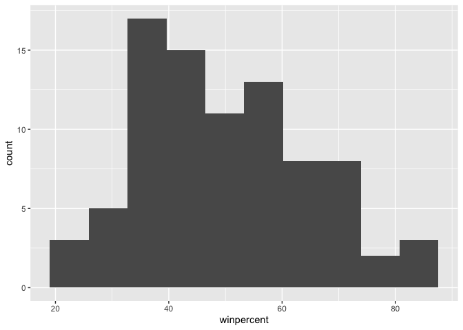
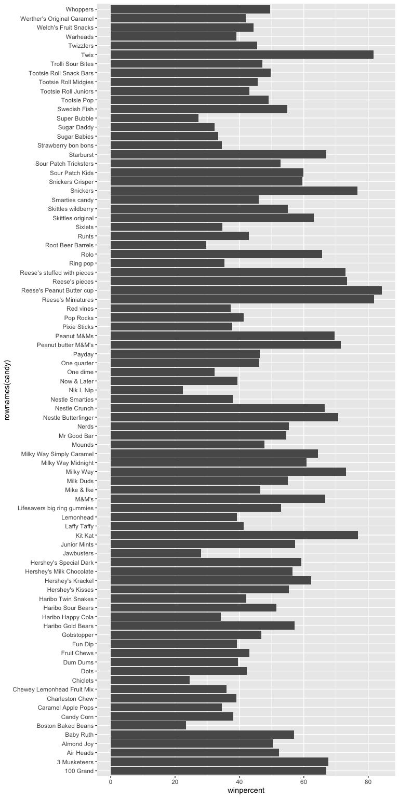
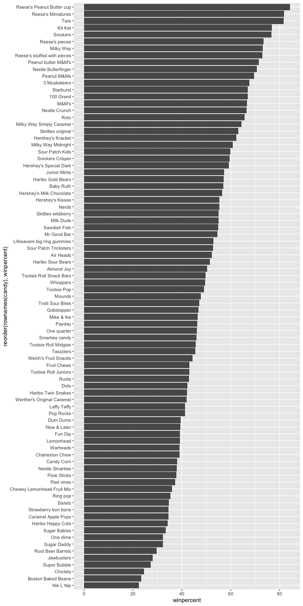
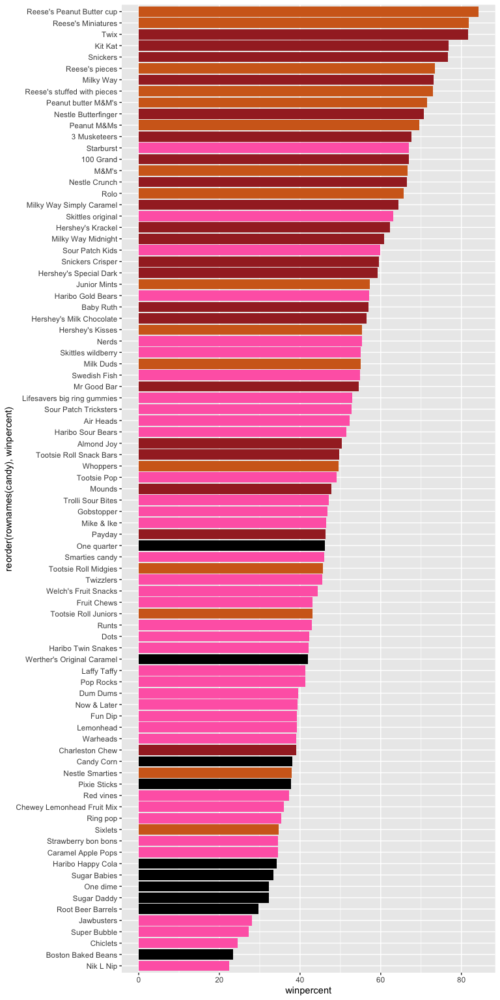
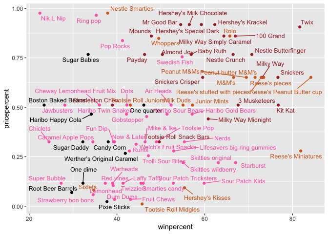
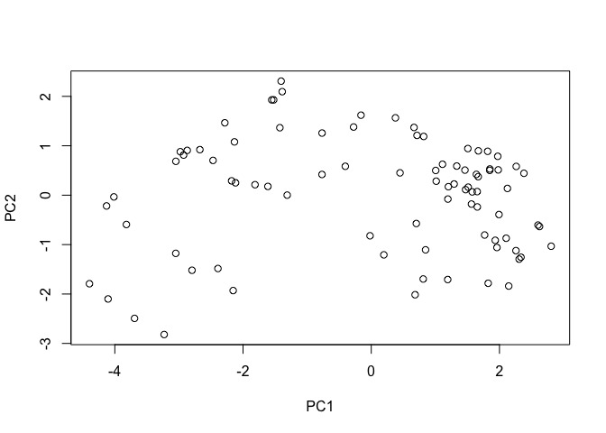
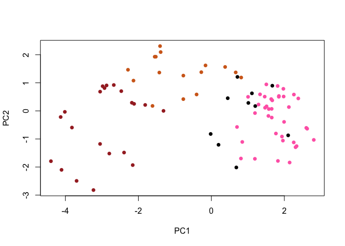
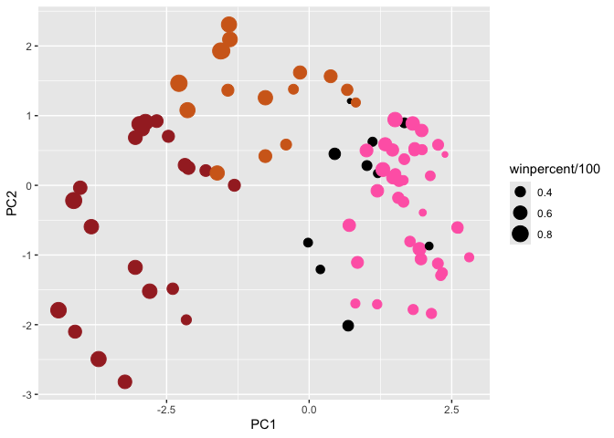
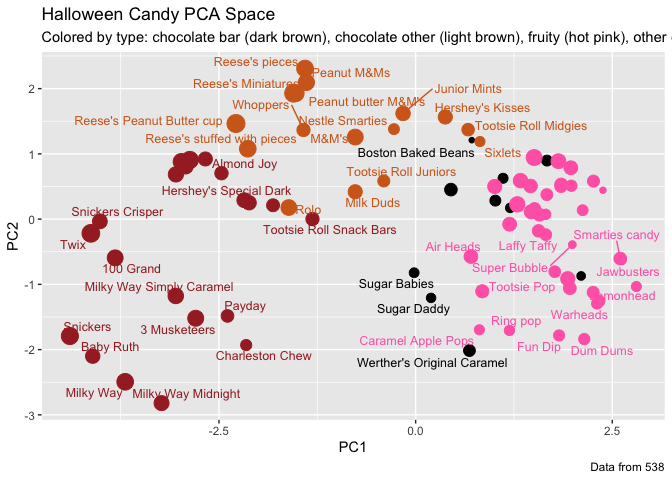

# Class09_Candy_Project
Ivan Henry Kish(A17262923)

## Candy mini Project

Today we will analyze different kinds of candy and the different aspects
found between the different candies. First we must open the data set we
want to work with and then we will answer a couple questions.

``` r
candy_file <- "candy-data.csv"

candy = read.csv("https://raw.githubusercontent.com/fivethirtyeight/data/master/candy-power-ranking/candy-data.csv", row.names=1)
head(candy)
```

                 chocolate fruity caramel peanutyalmondy nougat crispedricewafer
    100 Grand            1      0       1              0      0                1
    3 Musketeers         1      0       0              0      1                0
    One dime             0      0       0              0      0                0
    One quarter          0      0       0              0      0                0
    Air Heads            0      1       0              0      0                0
    Almond Joy           1      0       0              1      0                0
                 hard bar pluribus sugarpercent pricepercent winpercent
    100 Grand       0   1        0        0.732        0.860   66.97173
    3 Musketeers    0   1        0        0.604        0.511   67.60294
    One dime        0   0        0        0.011        0.116   32.26109
    One quarter     0   0        0        0.011        0.511   46.11650
    Air Heads       0   0        0        0.906        0.511   52.34146
    Almond Joy      0   1        0        0.465        0.767   50.34755

> Q1. How many different candy types are in this data set?

``` r
nrow(candy)
```

    [1] 85

> Q2.How many fruity candy types are in the dataset?

``` r
sum(candy$fruity)
```

    [1] 38

> Q3. What is your favorite candy in the dataset `winpercent` value?

``` r
candy["Kit Kat",]$winpercent
```

    [1] 76.7686

> Q4. What is the `winpercent` value for “Starburst”?(orignal question
> wanted to analyze Kit Kat but that was my favorite candy so I chose
> another.)

``` r
candy["Starburst",]$winpercent
```

    [1] 67.03763

> Q5. What is the winpercent value for “Tootsie Roll Snack Bars”?

``` r
candy["Tootsie Roll Snack Bars",]$winpercent
```

    [1] 49.6535

## Side-note:

There is a useful `skim()` function in the skimr package that can help
give you a quick overview of a given dataset. Let’s install this package
and try it on our candy data.

``` r
library("skimr")
skim(candy)
```

|                                                  |       |
|:-------------------------------------------------|:------|
| Name                                             | candy |
| Number of rows                                   | 85    |
| Number of columns                                | 12    |
| \_\_\_\_\_\_\_\_\_\_\_\_\_\_\_\_\_\_\_\_\_\_\_   |       |
| Column type frequency:                           |       |
| numeric                                          | 12    |
| \_\_\_\_\_\_\_\_\_\_\_\_\_\_\_\_\_\_\_\_\_\_\_\_ |       |
| Group variables                                  | None  |

Data summary

**Variable type: numeric**

| skim_variable | n_missing | complete_rate | mean | sd | p0 | p25 | p50 | p75 | p100 | hist |
|:---|---:|---:|---:|---:|---:|---:|---:|---:|---:|:---|
| chocolate | 0 | 1 | 0.44 | 0.50 | 0.00 | 0.00 | 0.00 | 1.00 | 1.00 | ▇▁▁▁▆ |
| fruity | 0 | 1 | 0.45 | 0.50 | 0.00 | 0.00 | 0.00 | 1.00 | 1.00 | ▇▁▁▁▆ |
| caramel | 0 | 1 | 0.16 | 0.37 | 0.00 | 0.00 | 0.00 | 0.00 | 1.00 | ▇▁▁▁▂ |
| peanutyalmondy | 0 | 1 | 0.16 | 0.37 | 0.00 | 0.00 | 0.00 | 0.00 | 1.00 | ▇▁▁▁▂ |
| nougat | 0 | 1 | 0.08 | 0.28 | 0.00 | 0.00 | 0.00 | 0.00 | 1.00 | ▇▁▁▁▁ |
| crispedricewafer | 0 | 1 | 0.08 | 0.28 | 0.00 | 0.00 | 0.00 | 0.00 | 1.00 | ▇▁▁▁▁ |
| hard | 0 | 1 | 0.18 | 0.38 | 0.00 | 0.00 | 0.00 | 0.00 | 1.00 | ▇▁▁▁▂ |
| bar | 0 | 1 | 0.25 | 0.43 | 0.00 | 0.00 | 0.00 | 0.00 | 1.00 | ▇▁▁▁▂ |
| pluribus | 0 | 1 | 0.52 | 0.50 | 0.00 | 0.00 | 1.00 | 1.00 | 1.00 | ▇▁▁▁▇ |
| sugarpercent | 0 | 1 | 0.48 | 0.28 | 0.01 | 0.22 | 0.47 | 0.73 | 0.99 | ▇▇▇▇▆ |
| pricepercent | 0 | 1 | 0.47 | 0.29 | 0.01 | 0.26 | 0.47 | 0.65 | 0.98 | ▇▇▇▇▆ |
| winpercent | 0 | 1 | 50.32 | 14.71 | 22.45 | 39.14 | 47.83 | 59.86 | 84.18 | ▃▇▆▅▂ |

> Q6. Is there any variable/column that looks to be on a different scale
> to the majority of the other columns in the dataset?

Winpercent is the only variable which does not lie on a 1-0 scale and
goes much higher.

> Q7. What do you think a zero and one represent for the
> `candy$chocolate` column?

A 0 represents the candy is not chocolate and a 1 represents the candy
is chocolate.

## Exploratory analysis

We will now graphically analyze our data set with a histogram to answer
the following questions.

> Q8. Plot a histogram of winpercent values using both base R an
> ggplot2.

``` r
library(ggplot2)
ggplot(candy) + aes(winpercent) + geom_histogram(bins=10)
```



``` r
hist(candy$winpercent)
```


> Q9. Is the distribution of winpercent values symmetrical?

The winpercent values are not symmetrical.

> Q10.Is the center of the distribution above or below 50%?

``` r
ggplot(candy) + aes(winpercent) + geom_boxplot()
```


The center of distribution seems to be between 40%-50%.

> Q11.On average is chocolate candy higher or lower ranked than fruit
> candy?

Steps to solve this: 1. Find all chocolate candy in dataset. 2. Extract
their winpercent values 3. Calculate mean of these values

4.  Find all fruity candy

5.  Find their winpercent values

6.  Calculate their mean values.

7.  Compare mean values.

``` r
choc.candy <- candy[candy$chocolate==1,]
choc.win <- choc.candy$winpercent
mean(choc.win)
```

    [1] 60.92153

``` r
fruit.candy <- candy[candy$fruity==1,]
fruit.win <- fruit.candy$winpercent
mean(fruit.win)
```

    [1] 44.11974

> Q12. Is this difference statistically significant?

``` r
t.test(choc.win,
fruit.win)
```


        Welch Two Sample t-test

    data:  choc.win and fruit.win
    t = 6.2582, df = 68.882, p-value = 2.871e-08
    alternative hypothesis: true difference in means is not equal to 0
    95 percent confidence interval:
     11.44563 22.15795
    sample estimates:
    mean of x mean of y 
     60.92153  44.11974 

The low p-value means we can reject the null hypothesis that these means
are not signifcant and confidentlly state that the two means are
different.

## Overall Candy Rankings

Using `order()` and `head()` we can analyze the relative rankings of the
candies.

> Q13. What are the five least liked candy types in this set?

``` r
inds<- order(candy$winpercent)
head( candy[inds,], 5)
```

                       chocolate fruity caramel peanutyalmondy nougat
    Nik L Nip                  0      1       0              0      0
    Boston Baked Beans         0      0       0              1      0
    Chiclets                   0      1       0              0      0
    Super Bubble               0      1       0              0      0
    Jawbusters                 0      1       0              0      0
                       crispedricewafer hard bar pluribus sugarpercent pricepercent
    Nik L Nip                         0    0   0        1        0.197        0.976
    Boston Baked Beans                0    0   0        1        0.313        0.511
    Chiclets                          0    0   0        1        0.046        0.325
    Super Bubble                      0    0   0        0        0.162        0.116
    Jawbusters                        0    1   0        1        0.093        0.511
                       winpercent
    Nik L Nip            22.44534
    Boston Baked Beans   23.41782
    Chiclets             24.52499
    Super Bubble         27.30386
    Jawbusters           28.12744

The 5 least liked candies are Nik L Nip, Boston Baked beans, chiclets,
Super bubble, and jaw busters.

> Q14. What are the top 5 all time favorite candy types out of this set?

``` r
inds<- order(candy$winpercent)
tail( candy[inds,], 5)
```

                              chocolate fruity caramel peanutyalmondy nougat
    Snickers                          1      0       1              1      1
    Kit Kat                           1      0       0              0      0
    Twix                              1      0       1              0      0
    Reese's Miniatures                1      0       0              1      0
    Reese's Peanut Butter cup         1      0       0              1      0
                              crispedricewafer hard bar pluribus sugarpercent
    Snickers                                 0    0   1        0        0.546
    Kit Kat                                  1    0   1        0        0.313
    Twix                                     1    0   1        0        0.546
    Reese's Miniatures                       0    0   0        0        0.034
    Reese's Peanut Butter cup                0    0   0        0        0.720
                              pricepercent winpercent
    Snickers                         0.651   76.67378
    Kit Kat                          0.511   76.76860
    Twix                             0.906   81.64291
    Reese's Miniatures               0.279   81.86626
    Reese's Peanut Butter cup        0.651   84.18029

The top 5 are snickers, Kit kat, Twix, Reese’s Miniatures, and Reese’s
Peanut Butter cup.

> Q15. Make a first barplot of candy ranking based on `winpercent`
> values.

``` r
ggplot(candy) + 
  aes(winpercent, rownames(candy)) +
  geom_col()
```



``` r
ggsave("barplot1.png", height=10, width=6)
```

> Q16. This is quite ugly, use the `reorder()` function to get the bars
> sorted by `winpercent`?

``` r
ggplot(candy) + 
  aes(winpercent, reorder(rownames(candy),winpercent)) +
  geom_col()
```



## Time to add some color

We will now set up a color vector to signify candy type. First we make a
vector of all black values(one for each candy.) We will then create
colors for the chocolate and fruity candies.

``` r
my_cols=rep("black", nrow(candy))
my_cols[as.logical(candy$chocolate)] = "chocolate"
my_cols[as.logical(candy$bar)] = "brown"
my_cols[as.logical(candy$fruity)] = "hotpink"
```

``` r
ggplot(candy) + 
  aes(winpercent, reorder(rownames(candy),winpercent)) +
  geom_col(fill=my_cols) 
```



> Q17. What is the worst ranked chocolate candy?

Sixlets are the worst ranked chocolate candy.

> Q18. What is the best ranked fruity candy?

Starburst are the best ranked fruity candy.

## Looking at pricepercent

It is reasonable to wonder, “what candy gives me the best bang for my
buck?”. We can find this by plotting winpercent against pricepercent. We
can plot this and add labels to I.D. the different candies. We will use
`geom_text_repel()` from the ggrepel package to give us nice and
readable labels.

``` r
library(ggrepel)

# How about a plot of win vs price
ggplot(candy) +
  aes(winpercent, pricepercent, label=rownames(candy)) +
  geom_point(col=my_cols) + 
  geom_text_repel(col=my_cols, size=3.3, max.overlaps = 25)
```



> Q19. Which candy type is the highest ranked in terms of `winpercent`
> for the least money - i.e. offers the most bang for your buck?

Reese’s miniatures seems to have the highest winpercent while still
being below 50% pricepercent.

> Q20. What are the top 5 most expensive candy types in the dataset and
> of these which is the least popular?

``` r
ord <- order(candy$pricepercent, decreasing = TRUE)
head(candy[ord,c(11,12)], n =5)
```

                             pricepercent winpercent
    Nik L Nip                       0.976   22.44534
    Nestle Smarties                 0.976   37.88719
    Ring pop                        0.965   35.29076
    Hershey's Krackel               0.918   62.28448
    Hershey's Milk Chocolate        0.918   56.49050

Of these 5 most expensive candies Nik L Nip is by far the least liked
candy.

## Exploring the correlation structure

Now that we’ve explored the dataset a little, we’ll see how the
variables interact with one another. We’ll use correlation and view the
results with the **corrplot** package to plot a correlation matrix.

``` r
library(corrplot)
```

    corrplot 0.95 loaded

``` r
cij <- cor(candy)
corrplot(cij)
```


> Q22.Examining this plot what two variables are anti-correlated
> (i.e. have minus values)?

If any two given variables have a hue in the red spectrum then they are
anti-correlated.

> Q23.Similarly, what two variables are most positively correlated?

If any two given variable have a hue in the blue spectrum they are
positively correlated.

## Principal Component Analysis

Let’s apply PCA using the `prcomp()` function to our candy dataset
remembering to set the `scale=TRUE` argument.

``` r
pca <- prcomp(candy, scale=T)
summary(pca)
```

    Importance of components:
                              PC1    PC2    PC3     PC4    PC5     PC6     PC7
    Standard deviation     2.0788 1.1378 1.1092 1.07533 0.9518 0.81923 0.81530
    Proportion of Variance 0.3601 0.1079 0.1025 0.09636 0.0755 0.05593 0.05539
    Cumulative Proportion  0.3601 0.4680 0.5705 0.66688 0.7424 0.79830 0.85369
                               PC8     PC9    PC10    PC11    PC12
    Standard deviation     0.74530 0.67824 0.62349 0.43974 0.39760
    Proportion of Variance 0.04629 0.03833 0.03239 0.01611 0.01317
    Cumulative Proportion  0.89998 0.93832 0.97071 0.98683 1.00000

Now we can plot our main PCA score plot of PC1 vs PC2

``` r
plot(pca$x[,1:2])
```



Now let’s add some color and change the plotting character.

``` r
plot(pca$x[,1:2], col=my_cols, pch=16)
```



It’s possible to make a nicer plot with ggplot2 given that we supply an
input data.frame that has a seperate column for each of the aesthetics
we want in our final plot.

``` r
# Make a new data-frame with our PCA results and candy data
my_data <- cbind(candy, pca$x[,1:3])
```

``` r
p <- ggplot(my_data) + 
        aes(x=PC1, y=PC2, 
            size=winpercent/100,  
            text=rownames(my_data),
            label=rownames(my_data)) +
        geom_point(col=my_cols)

p
```



We can again use ggrepel to label the plot with non overlapping candy
names as well as adding a title and subtitle.

``` r
library(ggrepel)

p + geom_text_repel(size=3.3, col=my_cols, max.overlaps = 7)  + 
  theme(legend.position = "none") +
  labs(title="Halloween Candy PCA Space",
       subtitle="Colored by type: chocolate bar (dark brown), chocolate other (light brown), fruity (hot pink), other (black)",
       caption="Data from 538")
```

    Warning: ggrepel: 39 unlabeled data points (too many overlaps). Consider
    increasing max.overlaps



If we want to see more points with more defined labels we can use plotly
to create an interactive plot where we can use our mouse to see what
each point is.

``` r
#library(plotly)
#ggplotly(p)
```

Let’s “loading plot for PC1

``` r
ggplot(pca$rotation) +
  aes(PC1, reorder(rownames(pca$rotation),PC1)) +
  geom_col() 
```


> Q24. Complete the code to generate the loadings plot above. What
> original variables are picked up strongly by PC1 in the positive
> direction? Do these make sense to you? Where did you see this
> relationship highlighted previously?

Fruity and pluribus contribute strongly to PC1 in the positive direction
which makes sense since these are similar trends that we saw in the
correlation plot we made earlier.

## Summary

In this project we characterized the structure of the candy data set
identifying key variables and then built visualizations to reveal
relationships between candy popularity and pricing. Then using PCA we
revealed that the primary axis of variation separates chocolate-based
candies from fruity ones - the same pattern we observed in the
correlation matrix, now visualized in a single, easy to read plot.

> Q25. Based on your exploratory analysis, correlation findings, and PCA
> results, what combination of characteristics appears to make a
> “winning” candy? How do these different analyses (visualization,
> correlation, PCA) support or complement each other in reaching this
> conclusion?

Looking at our varies visualization, correlation, and PCA charts we see
that the most popular candies are those that are chocolates and bars
with relatively reasonable pricing which is seein in our PCA plots and
our PCA loadings.
