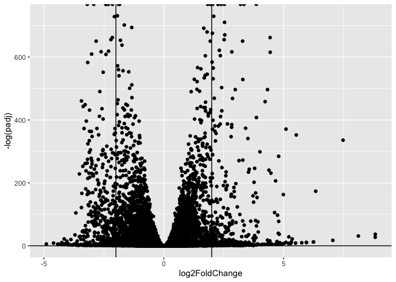
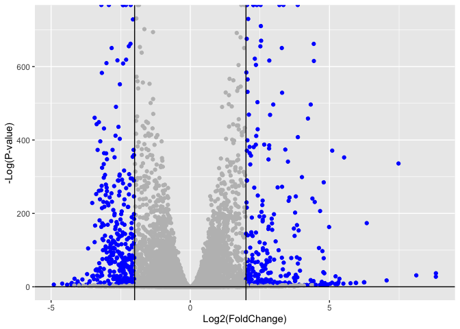
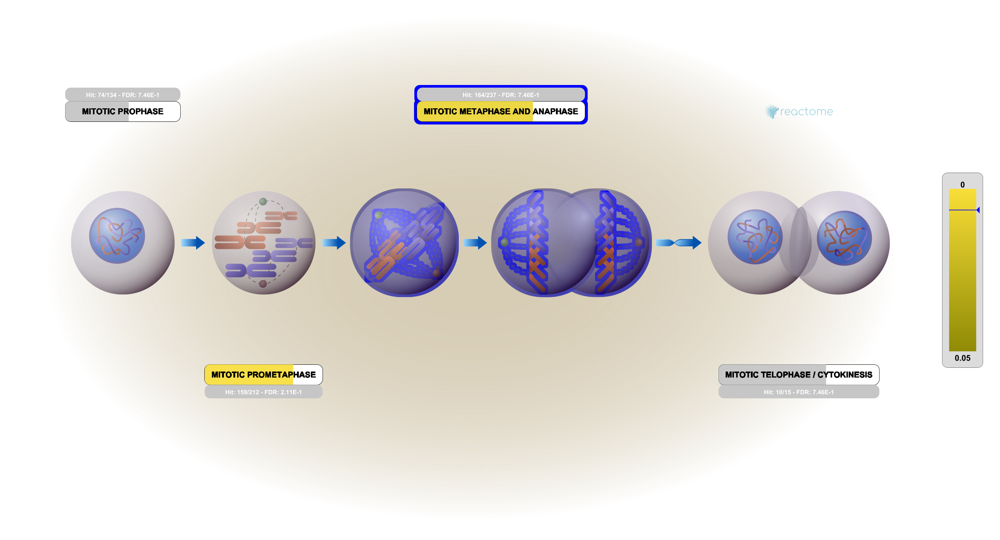

# Class 14: RNASeq Mini-Project
Ivan Kish(PID:A17262923)

- [Background](#background)
- [Data Import](#data-import)
  - [Clean up (data tidying)](#clean-up-data-tidying)
- [DESeq Analysis](#deseq-analysis)
  - [Setting up the DESeq object](#setting-up-the-deseq-object)
  - [Running DESeq](#running-deseq)
  - [Getting results](#getting-results)
- [Volcano Plot](#volcano-plot)
- [Add Annotation](#add-annotation)
- [Pathway Analysis](#pathway-analysis)
  - [KEGG](#kegg)
  - [GO](#go)
  - [Reactome](#reactome)

## Background

The data for today’s mini-project comes from a knock-down study of an
important HOX gene.

## Data Import

``` r
countData <- read.csv("GSE37704_featurecounts (2).csv", row.names = 1)
colData <-  read.csv("GSE37704_metadata.csv")
head(countData)
```

                    length SRR493366 SRR493367 SRR493368 SRR493369 SRR493370
    ENSG00000186092    918         0         0         0         0         0
    ENSG00000279928    718         0         0         0         0         0
    ENSG00000279457   1982        23        28        29        29        28
    ENSG00000278566    939         0         0         0         0         0
    ENSG00000273547    939         0         0         0         0         0
    ENSG00000187634   3214       124       123       205       207       212
                    SRR493371
    ENSG00000186092         0
    ENSG00000279928         0
    ENSG00000279457        46
    ENSG00000278566         0
    ENSG00000273547         0
    ENSG00000187634       258

``` r
colData
```

             id     condition
    1 SRR493366 control_sirna
    2 SRR493367 control_sirna
    3 SRR493368 control_sirna
    4 SRR493369      hoxa1_kd
    5 SRR493370      hoxa1_kd
    6 SRR493371      hoxa1_kd

### Clean up (data tidying)

> Q. Complete the code below to remove the troublesome first column from
> countData

``` r
countData <- as.matrix(countData[,-1])
head(countData)
```

                    SRR493366 SRR493367 SRR493368 SRR493369 SRR493370 SRR493371
    ENSG00000186092         0         0         0         0         0         0
    ENSG00000279928         0         0         0         0         0         0
    ENSG00000279457        23        28        29        29        28        46
    ENSG00000278566         0         0         0         0         0         0
    ENSG00000273547         0         0         0         0         0         0
    ENSG00000187634       124       123       205       207       212       258

> Q. Complete the code below to filter countData to exclude genes
> (i.e. rows) where we have 0 read count across all samples
> (i.e. columns).

``` r
countData = countData[-rowSums(countData!=0),]
head(countData)
```

                    SRR493366 SRR493367 SRR493368 SRR493369 SRR493370 SRR493371
    ENSG00000188976      1637      1831      2383      1226      1326      1504
    ENSG00000187961       120       153       180       236       255       357
    ENSG00000187583        24        48        65        44        48        64
    ENSG00000187642         4         9        16        14        16        16
    ENSG00000188290        31        34        57       172       172       223
    ENSG00000187608       244       289       386       373       422       430

## DESeq Analysis

``` r
library(DESeq2)
```

### Setting up the DESeq object

``` r
dds = DESeqDataSetFromMatrix(countData=countData,
                             colData=colData,
                             design=~condition)
```

    Warning in DESeqDataSet(se, design = design, ignoreRank): some variables in
    design formula are characters, converting to factors

``` r
dds = DESeq(dds)
```

    estimating size factors

    estimating dispersions

    gene-wise dispersion estimates

    mean-dispersion relationship

    final dispersion estimates

    fitting model and testing

### Running DESeq

``` r
dds
```

    class: DESeqDataSet 
    dim: 19802 6 
    metadata(1): version
    assays(4): counts mu H cooks
    rownames(19802): ENSG00000188976 ENSG00000187961 ... ENSG00000277475
      ENSG00000268674
    rowData names(22): baseMean baseVar ... deviance maxCooks
    colnames(6): SRR493366 SRR493367 ... SRR493370 SRR493371
    colData names(3): id condition sizeFactor

### Getting results

``` r
resultsNames(dds)
```

    [1] "Intercept"                           "condition_hoxa1_kd_vs_control_sirna"

``` r
res = results(dds)
res
```

    log2 fold change (MLE): condition hoxa1 kd vs control sirna 
    Wald test p-value: condition hoxa1 kd vs control sirna 
    DataFrame with 19802 rows and 6 columns
                     baseMean log2FoldChange     lfcSE       stat      pvalue
                    <numeric>      <numeric> <numeric>  <numeric>   <numeric>
    ENSG00000188976 1651.1671     -0.6926547 0.0548586 -12.626185 1.51443e-36
    ENSG00000187961  209.6376      0.7298186 0.1318816   5.533895 3.13197e-08
    ENSG00000187583   47.2548      0.0406457 0.2719379   0.149467 8.81185e-01
    ENSG00000187642   11.9797      0.5428889 0.5216403   1.040734 2.97999e-01
    ENSG00000188290  108.9228      2.0571342 0.1969309  10.445970 1.52885e-25
    ...                   ...            ...       ...        ...         ...
    ENSG00000277856     0.000             NA        NA         NA          NA
    ENSG00000275063     0.000             NA        NA         NA          NA
    ENSG00000271254   181.594      -0.609603  0.141347   -4.31283 1.61178e-05
    ENSG00000277475     0.000             NA        NA         NA          NA
    ENSG00000268674     0.000             NA        NA         NA          NA
                           padj
                      <numeric>
    ENSG00000188976 1.81682e-35
    ENSG00000187961 1.11424e-07
    ENSG00000187583 9.16701e-01
    ENSG00000187642 3.97259e-01
    ENSG00000188290 1.29290e-24
    ...                     ...
    ENSG00000277856          NA
    ENSG00000275063          NA
    ENSG00000271254 4.47015e-05
    ENSG00000277475          NA
    ENSG00000268674          NA

> Q. Call the summary() function on your results to get a sense of how
> many genes are up or down-regulated at the default 0.1 p-value cutoff.

``` r
summary(res)
```


    out of 15973 with nonzero total read count
    adjusted p-value < 0.1
    LFC > 0 (up)       : 4357, 27%
    LFC < 0 (down)     : 4408, 28%
    outliers [1]       : 0, 0%
    low counts [2]     : 1529, 9.6%
    (mean count < 1)
    [1] see 'cooksCutoff' argument of ?results
    [2] see 'independentFiltering' argument of ?results

## Volcano Plot

Now we will make a volcano plot, a commonly produced visualization from
this type of data that we introduced last day. Basically it’s a plot of
log2 fold change vs -log adjusted p-value.

``` r
library(ggplot2)

ggplot(res) +
  aes(log2FoldChange,
      -log(padj)) +
  geom_point() + geom_vline(xintercept = c(-2,+2)) +geom_hline(yintercept = 0.05)
```

    Warning: Removed 5358 rows containing missing values or values outside the scale range
    (`geom_point()`).



> Q. Improve this plot by completing the below code, which adds color,
> axis labels and cutoff lines:

``` r
mycols <- rep("gray", nrow(res) )


mycols[ abs(res$log2FoldChange) > 2 ] <- "blue"

mycols[ res$padj > 0.01 ] <- "gray"

ggplot(res) +
  aes(log2FoldChange,
      -log(padj)) +
  geom_point(col =mycols) +
  xlab("Log2(FoldChange)") +
  ylab("-Log(P-value)") +
  geom_vline(xintercept  = c(-2,2)) +
  geom_hline(yintercept = 0.05)
```

    Warning: Removed 5358 rows containing missing values or values outside the scale range
    (`geom_point()`).



## Add Annotation

Since we mapped and counted against the Ensembl annotation, our results
only have information about Ensembl gene IDs. However, our pathway
analysis downstream will use KEGG pathways, and genes in KEGG pathways
are annotated with Entrez gene IDs. So lets add them as we did the last
day.

> Q.Use the mapIDs() function multiple times to add SYMBOL, ENTREZID and
> GENENAME annotation to our results by completing the code below

``` r
library("AnnotationDbi")
library("org.Hs.eg.db")
```

``` r
columns(org.Hs.eg.db)
```

     [1] "ACCNUM"       "ALIAS"        "ENSEMBL"      "ENSEMBLPROT"  "ENSEMBLTRANS"
     [6] "ENTREZID"     "ENZYME"       "EVIDENCE"     "EVIDENCEALL"  "GENENAME"    
    [11] "GENETYPE"     "GO"           "GOALL"        "IPI"          "MAP"         
    [16] "OMIM"         "ONTOLOGY"     "ONTOLOGYALL"  "PATH"         "PFAM"        
    [21] "PMID"         "PROSITE"      "REFSEQ"       "SYMBOL"       "UCSCKG"      
    [26] "UNIPROT"     

``` r
res$symbol = mapIds(org.Hs.eg.db,
                    keys= rownames(res), 
                    keytype="ENSEMBL",
                    column="SYMBOL",
                    multiVals="first")
```

    'select()' returned 1:many mapping between keys and columns

``` r
res$entrez = mapIds(org.Hs.eg.db,
                    keys=rownames(res),
                    keytype="ENSEMBL",
                    column="ENTREZID",
                    multiVals="first")
```

    'select()' returned 1:many mapping between keys and columns

``` r
res$name =   mapIds(org.Hs.eg.db,
                    keys=row.names(res),
                    keytype="ENSEMBL",
                    column="ENTREZID",
                    multiVals="first")
```

    'select()' returned 1:many mapping between keys and columns

``` r
head(res, 10)
```

    log2 fold change (MLE): condition hoxa1 kd vs control sirna 
    Wald test p-value: condition hoxa1 kd vs control sirna 
    DataFrame with 10 rows and 9 columns
                       baseMean log2FoldChange     lfcSE       stat      pvalue
                      <numeric>      <numeric> <numeric>  <numeric>   <numeric>
    ENSG00000188976 1651.167084     -0.6926547 0.0548586 -12.626185 1.51443e-36
    ENSG00000187961  209.637584      0.7298186 0.1318816   5.533895 3.13197e-08
    ENSG00000187583   47.254807      0.0406457 0.2719379   0.149467 8.81185e-01
    ENSG00000187642   11.979708      0.5428889 0.5216403   1.040734 2.97999e-01
    ENSG00000188290  108.922825      2.0571342 0.1969309  10.445970 1.52885e-25
    ENSG00000187608  350.714974      0.2574511 0.1027442   2.505747 1.22193e-02
    ENSG00000188157 9128.396655      0.3899749 0.0467229   8.346549 7.02863e-17
    ENSG00000237330    0.158192      0.7860197 4.0804729   0.192630 8.47249e-01
    ENSG00000131591  156.478099      0.1966549 0.1456338   1.350339 1.76907e-01
    ENSG00000162571    0.000000             NA        NA         NA          NA
                           padj      symbol      entrez        name
                      <numeric> <character> <character> <character>
    ENSG00000188976 1.81682e-35       NOC2L       26155       26155
    ENSG00000187961 1.11424e-07      KLHL17      339451      339451
    ENSG00000187583 9.16701e-01     PLEKHN1       84069       84069
    ENSG00000187642 3.97259e-01       PERM1       84808       84808
    ENSG00000188290 1.29290e-24        HES4       57801       57801
    ENSG00000187608 2.32629e-02       ISG15        9636        9636
    ENSG00000188157 4.12689e-16        AGRN      375790      375790
    ENSG00000237330          NA      RNF223      401934      401934
    ENSG00000131591 2.56551e-01    C1orf159       54991       54991
    ENSG00000162571          NA      TTLL10      254173      254173

> Q. Finally for this section let’s reorder these results by adjusted
> p-value and save them to a CSV file in your current project directory.

``` r
res = res[order(res$pvalue),]
write.csv(res, file="deseq_results.csv")
```

## Pathway Analysis

Here we are going to use the gage package for pathway analysis. Once we
have a list of enriched pathways, we’re going to use the pathview
package to draw pathway diagrams, shading the molecules in the pathway
by their degree of up/down-regulation.

### KEGG

First let’s load the packages and setup the KEGG data-sets we need

``` r
library(pathview)
```

    ##############################################################################
    Pathview is an open source software package distributed under GNU General
    Public License version 3 (GPLv3). Details of GPLv3 is available at
    http://www.gnu.org/licenses/gpl-3.0.html. Particullary, users are required to
    formally cite the original Pathview paper (not just mention it) in publications
    or products. For details, do citation("pathview") within R.

    The pathview downloads and uses KEGG data. Non-academic uses may require a KEGG
    license agreement (details at http://www.kegg.jp/kegg/legal.html).
    ##############################################################################

``` r
library(gage)
```

``` r
library(gageData)

data(kegg.sets.hs)
data(sigmet.idx.hs)

# Focus on signaling and metabolic pathways only
kegg.sets.hs = kegg.sets.hs[sigmet.idx.hs]

# Examine the first 3 pathways
head(kegg.sets.hs, 3)
```

    $`hsa00232 Caffeine metabolism`
    [1] "10"   "1544" "1548" "1549" "1553" "7498" "9"   

    $`hsa00983 Drug metabolism - other enzymes`
     [1] "10"     "1066"   "10720"  "10941"  "151531" "1548"   "1549"   "1551"  
     [9] "1553"   "1576"   "1577"   "1806"   "1807"   "1890"   "221223" "2990"  
    [17] "3251"   "3614"   "3615"   "3704"   "51733"  "54490"  "54575"  "54576" 
    [25] "54577"  "54578"  "54579"  "54600"  "54657"  "54658"  "54659"  "54963" 
    [33] "574537" "64816"  "7083"   "7084"   "7172"   "7363"   "7364"   "7365"  
    [41] "7366"   "7367"   "7371"   "7372"   "7378"   "7498"   "79799"  "83549" 
    [49] "8824"   "8833"   "9"      "978"   

    $`hsa00230 Purine metabolism`
      [1] "100"    "10201"  "10606"  "10621"  "10622"  "10623"  "107"    "10714" 
      [9] "108"    "10846"  "109"    "111"    "11128"  "11164"  "112"    "113"   
     [17] "114"    "115"    "122481" "122622" "124583" "132"    "158"    "159"   
     [25] "1633"   "171568" "1716"   "196883" "203"    "204"    "205"    "221823"
     [33] "2272"   "22978"  "23649"  "246721" "25885"  "2618"   "26289"  "270"   
     [41] "271"    "27115"  "272"    "2766"   "2977"   "2982"   "2983"   "2984"  
     [49] "2986"   "2987"   "29922"  "3000"   "30833"  "30834"  "318"    "3251"  
     [57] "353"    "3614"   "3615"   "3704"   "377841" "471"    "4830"   "4831"  
     [65] "4832"   "4833"   "4860"   "4881"   "4882"   "4907"   "50484"  "50940" 
     [73] "51082"  "51251"  "51292"  "5136"   "5137"   "5138"   "5139"   "5140"  
     [81] "5141"   "5142"   "5143"   "5144"   "5145"   "5146"   "5147"   "5148"  
     [89] "5149"   "5150"   "5151"   "5152"   "5153"   "5158"   "5167"   "5169"  
     [97] "51728"  "5198"   "5236"   "5313"   "5315"   "53343"  "54107"  "5422"  
    [105] "5424"   "5425"   "5426"   "5427"   "5430"   "5431"   "5432"   "5433"  
    [113] "5434"   "5435"   "5436"   "5437"   "5438"   "5439"   "5440"   "5441"  
    [121] "5471"   "548644" "55276"  "5557"   "5558"   "55703"  "55811"  "55821" 
    [129] "5631"   "5634"   "56655"  "56953"  "56985"  "57804"  "58497"  "6240"  
    [137] "6241"   "64425"  "646625" "654364" "661"    "7498"   "8382"   "84172" 
    [145] "84265"  "84284"  "84618"  "8622"   "8654"   "87178"  "8833"   "9060"  
    [153] "9061"   "93034"  "953"    "9533"   "954"    "955"    "956"    "957"   
    [161] "9583"   "9615"  

The main `gage()` function requires a named vector of fold changes,
where the names of the values are the Entrez gene IDs.

``` r
foldchanges = res$log2FoldChange
names(foldchanges) = res$entrez
head(foldchanges)
```

         1266     54855      1465      2034      2150      6659 
    -2.422656  3.202017 -2.313674 -1.887955  3.344573  2.392353 

Now time to run the gage pathway analysis and look at the objects
returned from gage()

``` r
keggres = gage(foldchanges, gsets=kegg.sets.hs)
attributes(keggres)
```

    $names
    [1] "greater" "less"    "stats"  

Now let’s look at the first few pathway results

``` r
head(keggres$less)
```

                                             p.geomean stat.mean        p.val
    hsa04110 Cell cycle                   7.088745e-06 -4.432237 7.088745e-06
    hsa03030 DNA replication              9.433633e-05 -3.951509 9.433633e-05
    hsa03013 RNA transport                1.162033e-03 -3.080122 1.162033e-03
    hsa04114 Oocyte meiosis               2.566266e-03 -2.826979 2.566266e-03
    hsa03440 Homologous recombination     3.068576e-03 -2.852682 3.068576e-03
    hsa00010 Glycolysis / Gluconeogenesis 4.363460e-03 -2.663551 4.363460e-03
                                                q.val set.size         exp1
    hsa04110 Cell cycle                   0.001162554      124 7.088745e-06
    hsa03030 DNA replication              0.007735579       36 9.433633e-05
    hsa03013 RNA transport                0.063524478      149 1.162033e-03
    hsa04114 Oocyte meiosis               0.100649277      112 2.566266e-03
    hsa03440 Homologous recombination     0.100649277       28 3.068576e-03
    hsa00010 Glycolysis / Gluconeogenesis 0.119267900       65 4.363460e-03

Now, let’s try out the pathview() function to make a pathway plot with
our RNA-Seq expression results shown in color. First we will look at the
genes related to the cell cycle.

``` r
pathview(gene.data=foldchanges, pathway.id="hsa04110")
```

    'select()' returned 1:1 mapping between keys and columns

    Info: Working in directory /Users/ikish/Desktop/bimm143_github/Class14

    Info: Writing image file hsa04110.pathview.png


Now, let’s process our results more automatically of the top 5
upregulated pathways and then process to get the IDs needed for the
`pathview()` function.

``` r
keggrespathways <- rownames(keggres$greater)[1:5]

# Extract the 8 character long IDs part of each string
keggresids = substr(keggrespathways, start=1, stop=8)
keggresids
```

    [1] "hsa04740" "hsa04640" "hsa00140" "hsa04630" "hsa04976"

Finally, let us pas these IDs into the `pathview()` function to make
plots for the top 5 pathways.

``` r
pathview(gene.data=foldchanges, pathway.id=keggresids, species="hsa")
```

    'select()' returned 1:1 mapping between keys and columns

    Info: Working in directory /Users/ikish/Desktop/bimm143_github/Class14

    Info: Writing image file hsa04740.pathview.png

    'select()' returned 1:1 mapping between keys and columns

    Info: Working in directory /Users/ikish/Desktop/bimm143_github/Class14

    Info: Writing image file hsa04640.pathview.png

    'select()' returned 1:1 mapping between keys and columns

    Info: Working in directory /Users/ikish/Desktop/bimm143_github/Class14

    Info: Writing image file hsa00140.pathview.png

    'select()' returned 1:1 mapping between keys and columns

    Info: Working in directory /Users/ikish/Desktop/bimm143_github/Class14

    Info: Writing image file hsa04630.pathview.png

    'select()' returned 1:1 mapping between keys and columns

    Info: Working in directory /Users/ikish/Desktop/bimm143_github/Class14

    Info: Writing image file hsa04976.pathview.png

 
 


> Q. Can you do the same procedure as above to plot the pathview figures
> for the top 5 down-regulated pathways?

``` r
keggrespathways <- rownames(keggres$less)[1:5]

# Extract the 8 character long IDs part of each string
keggresids = substr(keggrespathways, start=1, stop=8)
keggresids
```

    [1] "hsa04110" "hsa03030" "hsa03013" "hsa04114" "hsa03440"

``` r
pathview(gene.data=foldchanges, pathway.id=keggresids, species="hsa")
```

    'select()' returned 1:1 mapping between keys and columns

    Info: Working in directory /Users/ikish/Desktop/bimm143_github/Class14

    Info: Writing image file hsa04110.pathview.png

    'select()' returned 1:1 mapping between keys and columns

    Info: Working in directory /Users/ikish/Desktop/bimm143_github/Class14

    Info: Writing image file hsa03030.pathview.png

    'select()' returned 1:1 mapping between keys and columns

    Info: Working in directory /Users/ikish/Desktop/bimm143_github/Class14

    Info: Writing image file hsa03013.pathview.png

    'select()' returned 1:1 mapping between keys and columns

    Info: Working in directory /Users/ikish/Desktop/bimm143_github/Class14

    Info: Writing image file hsa04114.pathview.png

    'select()' returned 1:1 mapping between keys and columns

    Info: Working in directory /Users/ikish/Desktop/bimm143_github/Class14

    Info: Writing image file hsa03440.pathview.png

 
 


### GO

We can also do a similar procedure with gene ontology. Similar to above,
go.sets.hs has all GO terms. go.subs.hs is a named list containing
indexes for the BP, CC, and MF ontologies. Let’s focus on BP (a.k.a
Biological Process) here.

``` r
data(go.sets.hs)
data(go.subs.hs)

# Focus on Biological Process subset of GO
gobpsets = go.sets.hs[go.subs.hs$BP]

gobpres = gage(foldchanges, gsets=gobpsets)

lapply(gobpres, head)
```

    $greater
                                                  p.geomean stat.mean        p.val
    GO:0007156 homophilic cell adhesion        1.733613e-05  4.210950 1.733613e-05
    GO:0048729 tissue morphogenesis            5.399194e-05  3.888869 5.399194e-05
    GO:0002009 morphogenesis of an epithelium  5.719588e-05  3.879053 5.719588e-05
    GO:0030855 epithelial cell differentiation 2.051573e-04  3.555054 2.051573e-04
    GO:0060562 epithelial tube morphogenesis   2.924611e-04  3.458763 2.924611e-04
    GO:0048598 embryonic morphogenesis         2.954529e-04  3.446965 2.954529e-04
                                                    q.val set.size         exp1
    GO:0007156 homophilic cell adhesion        0.07579358      137 1.733613e-05
    GO:0048729 tissue morphogenesis            0.08335347      483 5.399194e-05
    GO:0002009 morphogenesis of an epithelium  0.08335347      382 5.719588e-05
    GO:0030855 epithelial cell differentiation 0.16435924      299 2.051573e-04
    GO:0060562 epithelial tube morphogenesis   0.16435924      289 2.924611e-04
    GO:0048598 embryonic morphogenesis         0.16435924      498 2.954529e-04

    $less
                                                p.geomean stat.mean        p.val
    GO:0048285 organelle fission             6.657865e-16 -8.169820 6.657865e-16
    GO:0000280 nuclear division              1.804970e-15 -8.050607 1.804970e-15
    GO:0007067 mitosis                       1.804970e-15 -8.050607 1.804970e-15
    GO:0000087 M phase of mitotic cell cycle 4.778014e-15 -7.914486 4.778014e-15
    GO:0007059 chromosome segregation        1.084735e-11 -6.974104 1.084735e-11
    GO:0051301 cell division                 8.753221e-11 -6.454861 8.753221e-11
                                                    q.val set.size         exp1
    GO:0048285 organelle fission             2.630443e-12      386 6.657865e-16
    GO:0000280 nuclear division              2.630443e-12      362 1.804970e-15
    GO:0007067 mitosis                       2.630443e-12      362 1.804970e-15
    GO:0000087 M phase of mitotic cell cycle 5.222369e-12      373 4.778014e-15
    GO:0007059 chromosome segregation        9.484921e-09      146 1.084735e-11
    GO:0051301 cell division                 6.378181e-08      479 8.753221e-11

    $stats
                                               stat.mean     exp1
    GO:0007156 homophilic cell adhesion         4.210950 4.210950
    GO:0048729 tissue morphogenesis             3.888869 3.888869
    GO:0002009 morphogenesis of an epithelium   3.879053 3.879053
    GO:0030855 epithelial cell differentiation  3.555054 3.555054
    GO:0060562 epithelial tube morphogenesis    3.458763 3.458763
    GO:0048598 embryonic morphogenesis          3.446965 3.446965

### Reactome

Let’s now conduct over-representation enrichment analysis and
pathway-topology analysis with Reactome using the previous list of
significant genes generated from our differential expression results
above.

``` r
sig_genes <- res[res$padj <= 0.05 & !is.na(res$padj), "symbol"]
print(paste("Total number of significant genes:", length(sig_genes)))
```

    [1] "Total number of significant genes: 8156"

``` r
write.table(sig_genes, file="significant_genes.txt", row.names=FALSE, col.names=FALSE, quote=FALSE)
```

> Q.What pathway has the most significant “Entities p-value”? Do the
> most significant pathways listed match your previous KEGG results?
> What factors could cause differences between the two methods?

The pathway that has the most significant Entities p-value is the cell
cycle, mitotic pathway which is consistent with the KEGG results since
the cell cycle also had the most significant p-value in that results
list.


