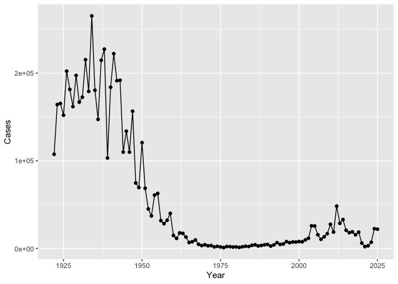
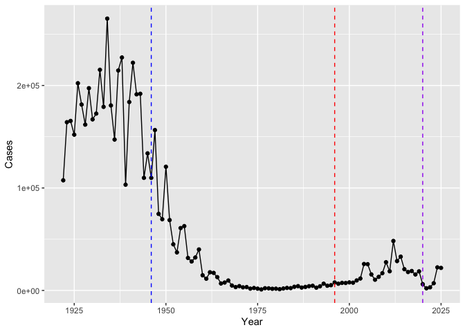
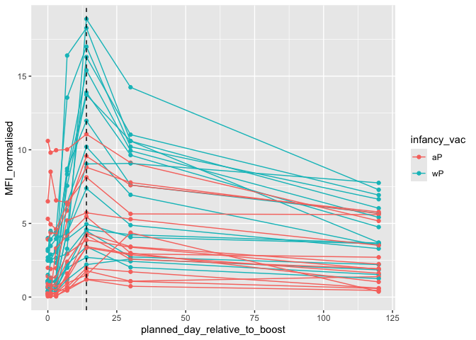
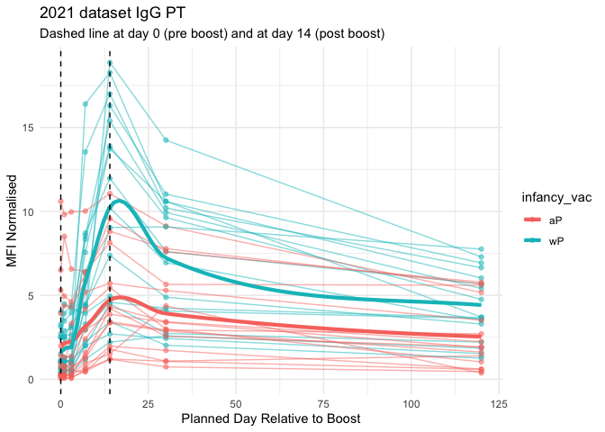

# Class 18
Ivan Kish (PID:A17262923)

- [Background](#background)
- [CMI-PB Project](#cmi-pb-project)
  - [Focus on “PT” Pertussis Toxin
    antigen](#focus-on-pt-pertussis-toxin-antigen)

## Background

Pertussis (a.k.a Whooping Cough) is a common lung infection caused by
the bacteria B. Pertussis.

This can infect people of any age but is most deadly in infants due to
their small airways and weakened immune response.

The CDC tracks the number of [reported cases in the
US](https://www.cdc.gov/pertussis/surv-reporting/cases-by-year.html) We
can “scrape’ this data with the **datapasta** package.

``` r
cdc <- data.frame(
                                 Year = c(1922L,1923L,1924L,1925L,
                                          1926L,1927L,1928L,1929L,1930L,1931L,
                                          1932L,1933L,1934L,1935L,1936L,
                                          1937L,1938L,1939L,1940L,1941L,1942L,
                                          1943L,1944L,1945L,1946L,1947L,
                                          1948L,1949L,1950L,1951L,1952L,
                                          1953L,1954L,1955L,1956L,1957L,1958L,
                                          1959L,1960L,1961L,1962L,1963L,
                                          1964L,1965L,1966L,1967L,1968L,1969L,
                                          1970L,1971L,1972L,1973L,1974L,
                                          1975L,1976L,1977L,1978L,1979L,1980L,
                                          1981L,1982L,1983L,1984L,1985L,
                                          1986L,1987L,1988L,1989L,1990L,
                                          1991L,1992L,1993L,1994L,1995L,1996L,
                                          1997L,1998L,1999L,2000L,2001L,
                                          2002L,2003L,2004L,2005L,2006L,2007L,
                                          2008L,2009L,2010L,2011L,2012L,
                                          2013L,2014L,2015L,2016L,2017L,2018L,
                                          2019L,2020L,2021L,2022L,2023L,2024L,2025L),
                                Cases = c(107473,164191,165418,152003,
                                          202210,181411,161799,197371,
                                          166914,172559,215343,179135,265269,
                                          180518,147237,214652,227319,103188,
                                          183866,222202,191383,191890,109873,
                                          133792,109860,156517,74715,69479,
                                          120718,68687,45030,37129,60886,
                                          62786,31732,28295,32148,40005,
                                          14809,11468,17749,17135,13005,6799,
                                          7717,9718,4810,3285,4249,3036,
                                          3287,1759,2402,1738,1010,2177,2063,
                                          1623,1730,1248,1895,2463,2276,
                                          3589,4195,2823,3450,4157,4570,
                                          2719,4083,6586,4617,5137,7796,6564,
                                          7405,7298,7867,7580,9771,11647,
                                          25827,25616,15632,10454,13278,
                                          16858,27550,18719,48277,28639,32971,
                                          20762,17972,18975,15609,18617,
                                          6124,2116,3044,7063,22538,21996)
       )
cdc
```

        Year  Cases
    1   1922 107473
    2   1923 164191
    3   1924 165418
    4   1925 152003
    5   1926 202210
    6   1927 181411
    7   1928 161799
    8   1929 197371
    9   1930 166914
    10  1931 172559
    11  1932 215343
    12  1933 179135
    13  1934 265269
    14  1935 180518
    15  1936 147237
    16  1937 214652
    17  1938 227319
    18  1939 103188
    19  1940 183866
    20  1941 222202
    21  1942 191383
    22  1943 191890
    23  1944 109873
    24  1945 133792
    25  1946 109860
    26  1947 156517
    27  1948  74715
    28  1949  69479
    29  1950 120718
    30  1951  68687
    31  1952  45030
    32  1953  37129
    33  1954  60886
    34  1955  62786
    35  1956  31732
    36  1957  28295
    37  1958  32148
    38  1959  40005
    39  1960  14809
    40  1961  11468
    41  1962  17749
    42  1963  17135
    43  1964  13005
    44  1965   6799
    45  1966   7717
    46  1967   9718
    47  1968   4810
    48  1969   3285
    49  1970   4249
    50  1971   3036
    51  1972   3287
    52  1973   1759
    53  1974   2402
    54  1975   1738
    55  1976   1010
    56  1977   2177
    57  1978   2063
    58  1979   1623
    59  1980   1730
    60  1981   1248
    61  1982   1895
    62  1983   2463
    63  1984   2276
    64  1985   3589
    65  1986   4195
    66  1987   2823
    67  1988   3450
    68  1989   4157
    69  1990   4570
    70  1991   2719
    71  1992   4083
    72  1993   6586
    73  1994   4617
    74  1995   5137
    75  1996   7796
    76  1997   6564
    77  1998   7405
    78  1999   7298
    79  2000   7867
    80  2001   7580
    81  2002   9771
    82  2003  11647
    83  2004  25827
    84  2005  25616
    85  2006  15632
    86  2007  10454
    87  2008  13278
    88  2009  16858
    89  2010  27550
    90  2011  18719
    91  2012  48277
    92  2013  28639
    93  2014  32971
    94  2015  20762
    95  2016  17972
    96  2017  18975
    97  2018  15609
    98  2019  18617
    99  2020   6124
    100 2021   2116
    101 2022   3044
    102 2023   7063
    103 2024  22538
    104 2025  21996

> Q. Make a plot of `year` vs `cases`

``` r
library(ggplot2)
 ggplot(cdc) + aes(Year, Cases) + geom_line() + geom_point()
```



> Q. Add some major milestones including he first wP vaccine
> rollout(1946), the switch to the newer aP vaccine (1996), and the
> COVID years(2020)

``` r
 ggplot(cdc) + aes(Year, Cases) + geom_line() + geom_point() +
  geom_vline(xintercept = 1946, col="blue", lty =2, ) +
  geom_vline(xintercept = 1996, col="red", lty =2 , ) +
    geom_vline(xintercept = 2020, col="purple", lty =2)
```



In 1945 the wP vaccine was introduced causing cases rates to begin to
drop dramatically. In 1996 the alternative aP vaccine was which wasn’t
as effective as the wP vaccine leading to the rise of cases and the need
for booster shots. Additionally, during the early 2000’s the anti-vax
movement began to gain major traction causing less people to give the
vaccine to their children and leading to a rise in cases. In 2020,
protocols desgined to limit the spread of COVID also limited the spread
of other transmissible diseases.

**Why is this vaccine-preventable disease on the upswing?** To answer
this question we need to investigate the mechanisms underlying waning
protection against pertussis. This requires evaluation of
pertussis-specific immune responses over time in wP and aP vaccinated
individuals.

# CMI-PB Project

[Computational Models of Immunity Pertssis
Boost](https://www.cmi-pb.org/)project aims to provide the
scientificcommunity with this very information.

They make their data vailable via JSON format APIs.we can read this in R
with the `read_json()` function from the **jsonlite** package.

``` r
library(jsonlite)
 subject <- read_json("http://cmi-pb.org/api/v5_1/subject", simplifyVector = TRUE)
 
 head(subject)
```

      subject_id infancy_vac biological_sex              ethnicity  race
    1          1          wP         Female Not Hispanic or Latino White
    2          2          wP         Female Not Hispanic or Latino White
    3          3          wP         Female                Unknown White
    4          4          wP           Male Not Hispanic or Latino Asian
    5          5          wP           Male Not Hispanic or Latino Asian
    6          6          wP         Female Not Hispanic or Latino White
      year_of_birth date_of_boost      dataset
    1    1986-01-01    2016-09-12 2020_dataset
    2    1968-01-01    2019-01-28 2020_dataset
    3    1983-01-01    2016-10-10 2020_dataset
    4    1988-01-01    2016-08-29 2020_dataset
    5    1991-01-01    2016-08-29 2020_dataset
    6    1988-01-01    2016-10-10 2020_dataset

> Q. How many “wP” and “aP” individuals are i this `subject` table.

``` r
table(subject$infancy_vac)
```


    aP wP 
    87 85 

> Q. What is the biological sex breakdown?

``` r
table(subject$biological_sex)
```


    Female   Male 
       112     60 

> Q. In terms of race and gender is this dataset representative of the
> US population?

``` r
table(subject$biological_sex, subject$race, subject$ethnicity)
```

    , ,  = Hispanic or Latino

            
             American Indian/Alaska Native Asian Black or African American
      Female                             0     0                         0
      Male                               0     0                         0
            
             More Than One Race Native Hawaiian or Other Pacific Islander
      Female                  9                                         0
      Male                    2                                         0
            
             Unknown or Not Reported White
      Female                      11    11
      Male                         4     4

    , ,  = Not Hispanic or Latino

            
             American Indian/Alaska Native Asian Black or African American
      Female                             0    32                         2
      Male                               1    12                         3
            
             More Than One Race Native Hawaiian or Other Pacific Islander
      Female                  6                                         1
      Male                    2                                         1
            
             Unknown or Not Reported White
      Female                       2    36
      Male                         1    27

    , ,  = Unknown

            
             American Indian/Alaska Native Asian Black or African American
      Female                             0     0                         0
      Male                               0     0                         0
            
             More Than One Race Native Hawaiian or Other Pacific Islander
      Female                  0                                         0
      Male                    0                                         0
            
             Unknown or Not Reported White
      Female                       1     1
      Male                         2     1

Let’s read some more database tables:

``` r
specimen <-  read_json("http://cmi-pb.org/api/v5_1/specimen", simplifyVector = TRUE
                    )
ab_titler <-  read_json("http://cmi-pb.org/api/v5_1/plasma_ab_titer", simplifyVector = TRUE)
```

``` r
head(specimen)
```

      specimen_id subject_id actual_day_relative_to_boost
    1           1          1                           -3
    2           2          1                            1
    3           3          1                            3
    4           4          1                            7
    5           5          1                           11
    6           6          1                           32
      planned_day_relative_to_boost specimen_type visit
    1                             0         Blood     1
    2                             1         Blood     2
    3                             3         Blood     3
    4                             7         Blood     4
    5                            14         Blood     5
    6                            30         Blood     6

``` r
head(ab_titler)
```

      specimen_id isotype is_antigen_specific antigen        MFI MFI_normalised
    1           1     IgE               FALSE   Total 1110.21154       2.493425
    2           1     IgE               FALSE   Total 2708.91616       2.493425
    3           1     IgG                TRUE      PT   68.56614       3.736992
    4           1     IgG                TRUE     PRN  332.12718       2.602350
    5           1     IgG                TRUE     FHA 1887.12263      34.050956
    6           1     IgE                TRUE     ACT    0.10000       1.000000
       unit lower_limit_of_detection
    1 UG/ML                 2.096133
    2 IU/ML                29.170000
    3 IU/ML                 0.530000
    4 IU/ML                 6.205949
    5 IU/ML                 4.679535
    6 IU/ML                 2.816431

To analyze this data we need to join (merge/link) multiple tables so we
have all the data in one place and not spread out everywhere.

We can use the `*_join()` family of functions from **dplyr** to do this.

``` r
library(dplyr)
```


    Attaching package: 'dplyr'

    The following objects are masked from 'package:stats':

        filter, lag

    The following objects are masked from 'package:base':

        intersect, setdiff, setequal, union

``` r
meta <-  inner_join(subject, specimen)
```

    Joining with `by = join_by(subject_id)`

``` r
head(meta)
```

      subject_id infancy_vac biological_sex              ethnicity  race
    1          1          wP         Female Not Hispanic or Latino White
    2          1          wP         Female Not Hispanic or Latino White
    3          1          wP         Female Not Hispanic or Latino White
    4          1          wP         Female Not Hispanic or Latino White
    5          1          wP         Female Not Hispanic or Latino White
    6          1          wP         Female Not Hispanic or Latino White
      year_of_birth date_of_boost      dataset specimen_id
    1    1986-01-01    2016-09-12 2020_dataset           1
    2    1986-01-01    2016-09-12 2020_dataset           2
    3    1986-01-01    2016-09-12 2020_dataset           3
    4    1986-01-01    2016-09-12 2020_dataset           4
    5    1986-01-01    2016-09-12 2020_dataset           5
    6    1986-01-01    2016-09-12 2020_dataset           6
      actual_day_relative_to_boost planned_day_relative_to_boost specimen_type
    1                           -3                             0         Blood
    2                            1                             1         Blood
    3                            3                             3         Blood
    4                            7                             7         Blood
    5                           11                            14         Blood
    6                           32                            30         Blood
      visit
    1     1
    2     2
    3     3
    4     4
    5     5
    6     6

``` r
abdata <- inner_join(ab_titler, meta)
```

    Joining with `by = join_by(specimen_id)`

``` r
head(abdata)
```

      specimen_id isotype is_antigen_specific antigen        MFI MFI_normalised
    1           1     IgE               FALSE   Total 1110.21154       2.493425
    2           1     IgE               FALSE   Total 2708.91616       2.493425
    3           1     IgG                TRUE      PT   68.56614       3.736992
    4           1     IgG                TRUE     PRN  332.12718       2.602350
    5           1     IgG                TRUE     FHA 1887.12263      34.050956
    6           1     IgE                TRUE     ACT    0.10000       1.000000
       unit lower_limit_of_detection subject_id infancy_vac biological_sex
    1 UG/ML                 2.096133          1          wP         Female
    2 IU/ML                29.170000          1          wP         Female
    3 IU/ML                 0.530000          1          wP         Female
    4 IU/ML                 6.205949          1          wP         Female
    5 IU/ML                 4.679535          1          wP         Female
    6 IU/ML                 2.816431          1          wP         Female
                   ethnicity  race year_of_birth date_of_boost      dataset
    1 Not Hispanic or Latino White    1986-01-01    2016-09-12 2020_dataset
    2 Not Hispanic or Latino White    1986-01-01    2016-09-12 2020_dataset
    3 Not Hispanic or Latino White    1986-01-01    2016-09-12 2020_dataset
    4 Not Hispanic or Latino White    1986-01-01    2016-09-12 2020_dataset
    5 Not Hispanic or Latino White    1986-01-01    2016-09-12 2020_dataset
    6 Not Hispanic or Latino White    1986-01-01    2016-09-12 2020_dataset
      actual_day_relative_to_boost planned_day_relative_to_boost specimen_type
    1                           -3                             0         Blood
    2                           -3                             0         Blood
    3                           -3                             0         Blood
    4                           -3                             0         Blood
    5                           -3                             0         Blood
    6                           -3                             0         Blood
      visit
    1     1
    2     1
    3     1
    4     1
    5     1
    6     1

> Q. What Antibody isotypes are measured for these patients?

``` r
table(abdata$isotype)
```


      IgE   IgG  IgG1  IgG2  IgG3  IgG4 
     6698  7265 11993 12000 12000 12000 

> Q12 . What are the different \$dataset values in abdata and what do
> you notice about the number of rows for the most “recent” dataset?

``` r
table(abdata$dataset)
```


    2020_dataset 2021_dataset 2022_dataset 2023_dataset 
           31520         8085         7301        15050 

> Q. What antigens are reported?

``` r
table(abdata$antigen)
```


        ACT   BETV1      DT   FELD1     FHA  FIM2/3   LOLP1     LOS Measles     OVA 
       1970    1970    6318    1970    6712    6318    1970    1970    1970    6318 
        PD1     PRN      PT     PTM   Total      TT 
       1970    6712    6712    1970     788    6318 

Let’s focus on the IgG isotype and make a plot of MFI_normalized for
antigens.

``` r
IgG <- abdata |> 
  filter(isotype=="IgG")
head(IgG)
```

      specimen_id isotype is_antigen_specific antigen        MFI MFI_normalised
    1           1     IgG                TRUE      PT   68.56614       3.736992
    2           1     IgG                TRUE     PRN  332.12718       2.602350
    3           1     IgG                TRUE     FHA 1887.12263      34.050956
    4          19     IgG                TRUE      PT   20.11607       1.096366
    5          19     IgG                TRUE     PRN  976.67419       7.652635
    6          19     IgG                TRUE     FHA   60.76626       1.096457
       unit lower_limit_of_detection subject_id infancy_vac biological_sex
    1 IU/ML                 0.530000          1          wP         Female
    2 IU/ML                 6.205949          1          wP         Female
    3 IU/ML                 4.679535          1          wP         Female
    4 IU/ML                 0.530000          3          wP         Female
    5 IU/ML                 6.205949          3          wP         Female
    6 IU/ML                 4.679535          3          wP         Female
                   ethnicity  race year_of_birth date_of_boost      dataset
    1 Not Hispanic or Latino White    1986-01-01    2016-09-12 2020_dataset
    2 Not Hispanic or Latino White    1986-01-01    2016-09-12 2020_dataset
    3 Not Hispanic or Latino White    1986-01-01    2016-09-12 2020_dataset
    4                Unknown White    1983-01-01    2016-10-10 2020_dataset
    5                Unknown White    1983-01-01    2016-10-10 2020_dataset
    6                Unknown White    1983-01-01    2016-10-10 2020_dataset
      actual_day_relative_to_boost planned_day_relative_to_boost specimen_type
    1                           -3                             0         Blood
    2                           -3                             0         Blood
    3                           -3                             0         Blood
    4                           -3                             0         Blood
    5                           -3                             0         Blood
    6                           -3                             0         Blood
      visit
    1     1
    2     1
    3     1
    4     1
    5     1
    6     1

``` r
ggplot(IgG) +
  aes(MFI_normalised, antigen)+
  geom_boxplot()
```


> Q. Is there a difference for aP vs. wP individuals with these values?

``` r
ggplot(IgG) +
  aes(MFI_normalised, antigen)+
  geom_boxplot() +
  facet_wrap(~infancy_vac)
```


``` r
ggplot(IgG) +
  aes(MFI_normalised, antigen, col=infancy_vac)+
  geom_boxplot()
```


> Q. Is there a temporal response - i.e do values increase or decrease
> over time?

``` r
ggplot(IgG) +
  aes(MFI_normalised, antigen, col=infancy_vac)+
  geom_boxplot() + facet_wrap(~visit)
```


## Focus on “PT” Pertussis Toxin antigen

``` r
pt.IgG.21 <- IgG |> filter (antigen=="PT",
               dataset== "2021_dataset")
```

``` r
ggplot(pt.IgG.21) +
  aes(planned_day_relative_to_boost, MFI_normalised, col=infancy_vac, group=subject_id)+
  geom_point() + 
  geom_line()+
  geom_vline(xintercept = 14, lty=2)
```



``` r
pt.IgG.21 %>% 
  filter(isotype == "IgG", antigen == "PT") %>%
  ggplot(aes(x = planned_day_relative_to_boost, 
             y = MFI_normalised, 
             col = infancy_vac)) +
  # 1. Individual lines: Keep group=subject_id here, but add transparency (alpha)
  geom_line(aes(group = subject_id), alpha = 0.5) + 
  geom_point(aes(group = subject_id), alpha = 0.5) +
  
  # 2. Average lines: Remove the subject grouping so it averages by infancy_vac
  # Using 'se = FALSE' hides the shaded confidence interval for a cleaner look
  geom_smooth(aes(group = infancy_vac), span=0.4 , method = "loess", se = FALSE, size = 1.5) +
  
  # Your existing vertical lines and labels
  geom_vline(xintercept = 0, linetype = "dashed") + 
  geom_vline(xintercept = 14, linetype = "dashed") +
  labs(title = "2021 dataset IgG PT",
       subtitle = "Dashed line at day 0 (pre boost) and at day 14 (post boost)",
       x = "Planned Day Relative to Boost",
       y = "MFI Normalised") +
  theme_minimal()
```

    `geom_smooth()` using formula = 'y ~ x'


