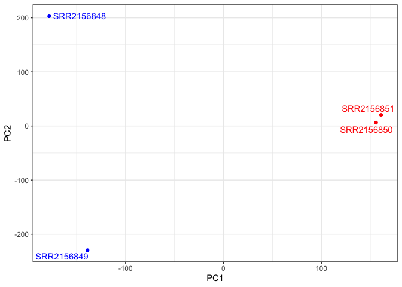
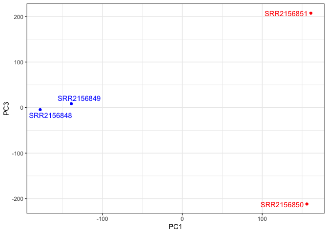
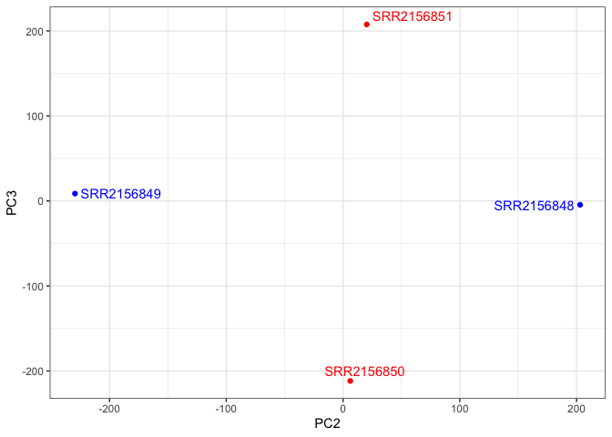

# Class 17
Ivan Kish(PID:A17262923)

- [PCA](#pca)

``` r
library(tximport)

# setup the folder and file-names to read
folders <- dir(pattern="SRR21568*")
samples <- sub("_quant", "", folders)
files <- file.path( folders, "abundance.h5" )
names(files) <- samples

txi.kallisto <- tximport(files, type = "kallisto", txOut = TRUE)
```

    1 2 3 4 

``` r
head(txi.kallisto$counts)
```

                    SRR2156848 SRR2156849 SRR2156850 SRR2156851
    ENST00000539570          0          0    0.00000          0
    ENST00000576455          0          0    2.62037          0
    ENST00000510508          0          0    0.00000          0
    ENST00000474471          0          1    1.00000          0
    ENST00000381700          0          0    0.00000          0
    ENST00000445946          0          0    0.00000          0

We now have our estimated transcript counts for each sample in R. We can
see how many transcripts we have for each sample

``` r
colSums(txi.kallisto$counts)
```

    SRR2156848 SRR2156849 SRR2156850 SRR2156851 
       2563611    2600800    2372309    2111474 

And how many transcripts are detected in at least one sample:

``` r
sum(rowSums(txi.kallisto$counts)>0)
```

    [1] 94561

Before subsequent analysis, we might want to filter out those annotated
transcripts with no reads:

``` r
to.keep <- rowSums(txi.kallisto$counts) > 0
kset.nonzero <- txi.kallisto$counts[to.keep,]
```

``` r
keep2 <- apply(kset.nonzero,1,sd)>0
x <- kset.nonzero[keep2,]
```

## PCA

``` r
pca <- prcomp(t(x), scale=TRUE)

summary(pca)
```

    Importance of components:
                                PC1      PC2      PC3   PC4
    Standard deviation     183.6379 177.3605 171.3020 1e+00
    Proportion of Variance   0.3568   0.3328   0.3104 1e-05
    Cumulative Proportion    0.3568   0.6895   1.0000 1e+00

Now to plot the results

> Q. Use ggplot to make a similar figure of PC1 vs PC2 and a separate
> figure PC1 vs PC3 and PC2 vs PC3.

``` r
plot(pca$x[,1], pca$x[,2],
     col=c("blue","blue","red","red"),
     xlab="PC1", ylab="PC2", pch=16)
```


``` r
library(ggplot2)
library(ggrepel)

mycols <- c("blue","blue","red","red")

ggplot(pca$x) +
  aes(PC1, PC2, label=rownames(pca$x)) +
  geom_point( col=mycols ) +
  geom_text_repel( col=mycols ) +
  theme_bw()
```



``` r
library(ggplot2)
library(ggrepel)

mycols <- c("blue","blue","red","red")

ggplot(pca$x) +
  aes(PC1, PC3, label=rownames(pca$x)) +
  geom_point( col=mycols ) +
  geom_text_repel( col=mycols ) +
  theme_bw()
```



``` r
library(ggplot2)
library(ggrepel)

mycols <- c("blue","blue","red","red")

ggplot(pca$x) +
  aes(PC2, PC3, label=rownames(pca$x)) +
  geom_point( col=mycols ) +
  geom_text_repel( col=mycols ) +
  theme_bw()
```


