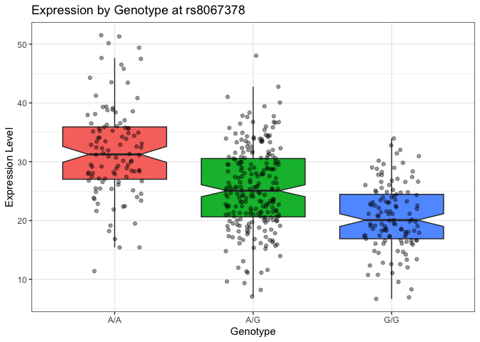

# Lab 12 Homework
Ivan Kish(PID:A17262923)

library(ggplot2)

``` r
url <- "https://bioboot.github.io/bggn213_W19/class-material/rs8067378_ENSG00000172057.6.txt"


genes <- read.table(url, header = TRUE)


head(genes)
```

       sample geno      exp
    1 HG00367  A/G 28.96038
    2 NA20768  A/G 20.24449
    3 HG00361  A/A 31.32628
    4 HG00135  A/A 34.11169
    5 NA18870  G/G 18.25141
    6 NA11993  A/A 32.89721

> Q13: Read this file into R and determine the sample size for each
> genotype and their corresponding median expression levels for each of
> these genotypes.

``` r
genotype_counts <- table(genes$geno)
print(genotype_counts)
```


    A/A A/G G/G 
    108 233 121 

``` r
median_expression <- tapply(genes$exp, genes$geno, median)
print(median_expression)
```

         A/A      A/G      G/G 
    31.24847 25.06486 20.07363 

> Q14: Generate a boxplot with a box per genotype, what could you infer
> from the relative expression value between A/A and G/G displayed in
> this plot? Does the SNP effect the expression of ORMDL3?

``` r
library(ggplot2)

ggplot(genes) +
  aes(x = geno, y = exp, fill = geno) +
  geom_boxplot(notch = TRUE, outlier.shape = NA) + 
  geom_jitter(width = 0.2, alpha = 0.4) +          
  theme_bw() +                                   
  labs(title = "Expression by Genotype at rs8067378",
       x = "Genotype",
       y = "Expression Level") +
  theme(legend.position = "none")                  
```



Looking at he box plot we can see that homozygous A\|A individuals show
a higher expression of the ORMDL3 gene with the heterozygous A\|G and
homozygous G\|G having increasingly lower expression levels showing that
depending on the content of the SNP the gene will have higher or lower
levels of expression.
